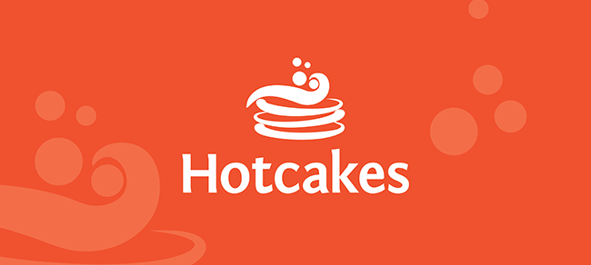

# 目标

<!-- hy-mt2-i18n:start -->
[English](./README.md) | [中文](./README_zh-CN.md) | [日本語](./README_ja.md) | **Español**
<!-- hy-mt2-i18n:end -->

将下方的 Markdown 格式数据翻译为西班牙语。

# 严格约束
1. **只输出译文**：仅返回翻译后的内容，不要添加任何其他文字。
2. **结构锁定**：必须完全保留原有的 Markdown 结构、缩进、标题层级、表格、链接、URL、徽章、代码块和行内代码，不得有任何改动。
3. **选择性翻译**：仅翻译面向用户展示的可见自然语言内容（正文、标题、说明文字和表格文本）。
4. **禁止修改**：**严禁**翻译或更改代码标签、键名、变量占位符（如 {{var}}、${var}、%s、%d 等）、命令示例、文件路径、项目名、API 名、包名、模型名、标识符和代码符号；除非原文已经给出对应译名。

# 数据输入
源文件：README.md

Markdown 内容：

Descripción del proyecto
==================
En Hotcakes Commerce, creemos que el comercio electrónico debe ser sencillo para todos los miembros de su equipo. Esta solución de comercio electrónico de código abierto cumple esa promesa.

Hotcakes Commerce es un CMS de comercio electrónico listo para uso empresarial que brinda capacidades a dueños de tiendas, desarrolladores y diseñadores. Le permite poner en marcha una tienda fácilmente, integrarla con cualquier sistema personalizado o de terceros, y al mismo tiempo ayudar a gestionar toda la presencia online de su empresa. Nos han dicho que es “mi empresa, en una caja”.

Además de ser un CMS de comercio electrónico de código abierto sólido, Hotcakes Commerce incluye las siguientes funciones integradas:

* Un editor de texto enriquecido
* Gestión de archivos
* Listo para la nube, con compatibilidad con MS Azure
* API para dispositivos móviles y detección básica de dispositivos móviles
* Núcleo escrito en C#
* Una sola instalación, múltiples portales
* Herramientas modernas del lado del cliente como CSS 3, HTML 5 y JQuery
* Seguridad robusta
* Funciones de administración como: roles de seguridad, contenido protegido y registro del sitio

Solución: Núcleo
-----------
Esta solución se considera el núcleo de las funcionalidades de comercio electrónico de Hotcakes Commerce. Aquí encontrará todas las características y capacidades relacionadas con el comercio electrónico.

Enlaces rápidos
-----------
* [Hotcakes en Facebook](http://www.facebook.com/HotcakesCommerce)
* [Comunidad](https://mmmcommerce.com/Community)
* [Recursos](https://mmmcommerce.com/Resources)
* [Soporte](https://upendoventures.com/Support)

Cómo contribuir
-----------------
Animamos a todos a que contribuyan.
Todas las detalles sobre cómo contribuir mediante Git y sobre nuestros métodos de trabajo se pueden encontrar aquí en la wiki.

  

## `Sponsors == (typeOf superHuman) Awesome;`  

> Sí, no es código real. Solo sirve para divertirse. :P

Esta solución fue creada y mantenida por [Upendo Ventures](https://upendoventures.com/What/CMS/DNN) para la [Comunidad de CMS DNN](https://dnncommunity.org). Por favor, considere [patrocinarnos](https://github.com/sponsors/UpendoVentures) para este proyecto y [para los muchos otros proyectos de código abierto en los que trabajamos](https://upendoventures.com/What/CMS/DNN/Extensions). Es mucho trabajo. :)  

- [Patrocínanos](https://github.com/sponsors/UpendoVentures) (estaremos agradecidos sin importar el monto 🙏🏽)  

